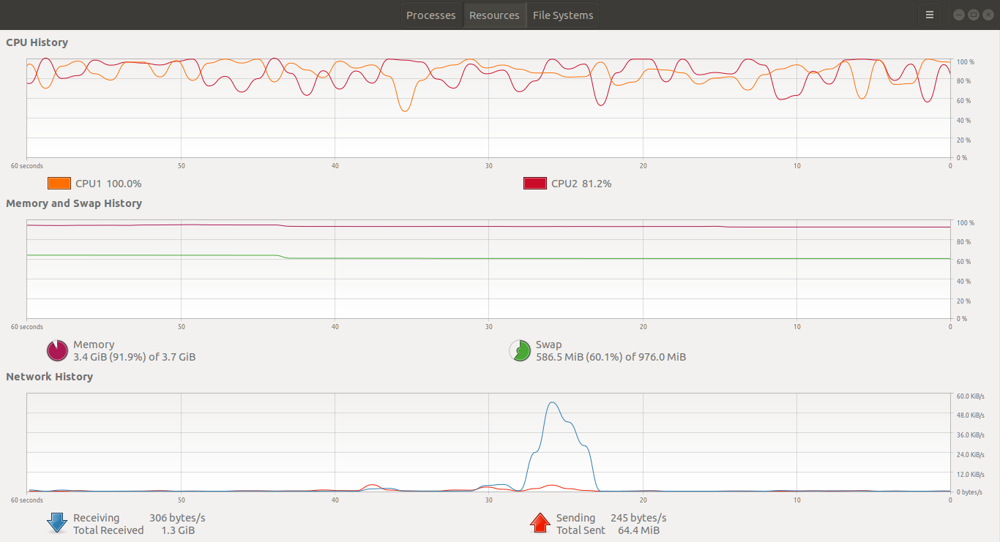
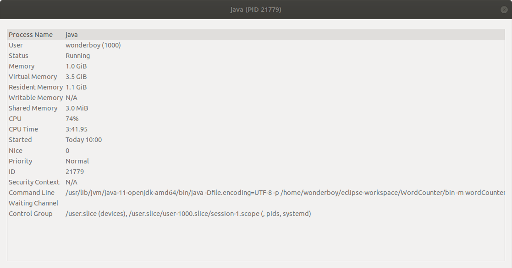
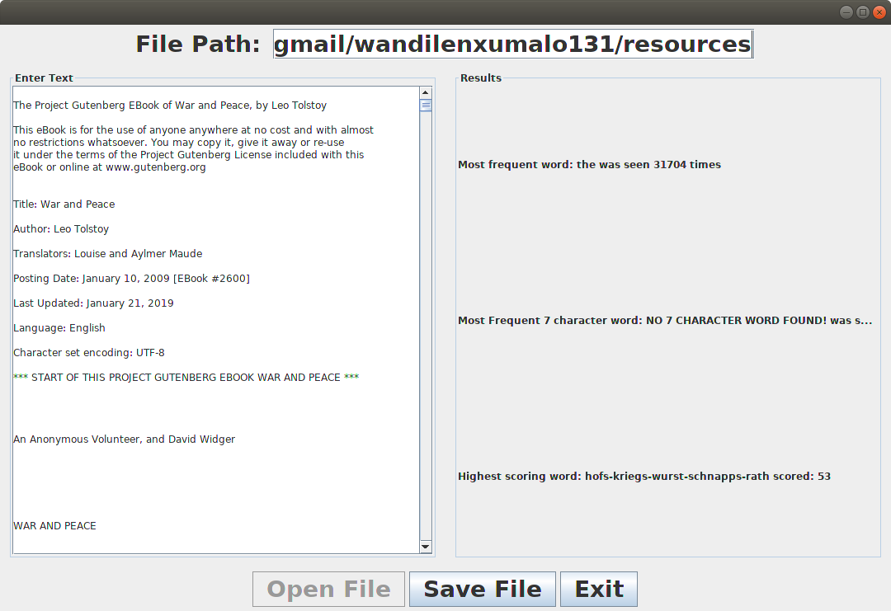

# WordCounterOfBook

The application performance graph:

The application performanc properties:

Application Performance
---
The application may work but it takes a long time to load and uses up the whole system properties. My program was using 1.2GB of RAM (of a 4GB RAM computer) and peaked at 92% of CPU usage. The application was using to much of my computer's resources and that is really fatal to the effeciency. 

The possible ways that can improve the performance is using less interations in the coding. This will make other objects and functions wait for the iteration to complete until they can do anything. The iteration is causes the deadlock.

Application Preview:
---

Resources
---

* Oracle Java documentation
